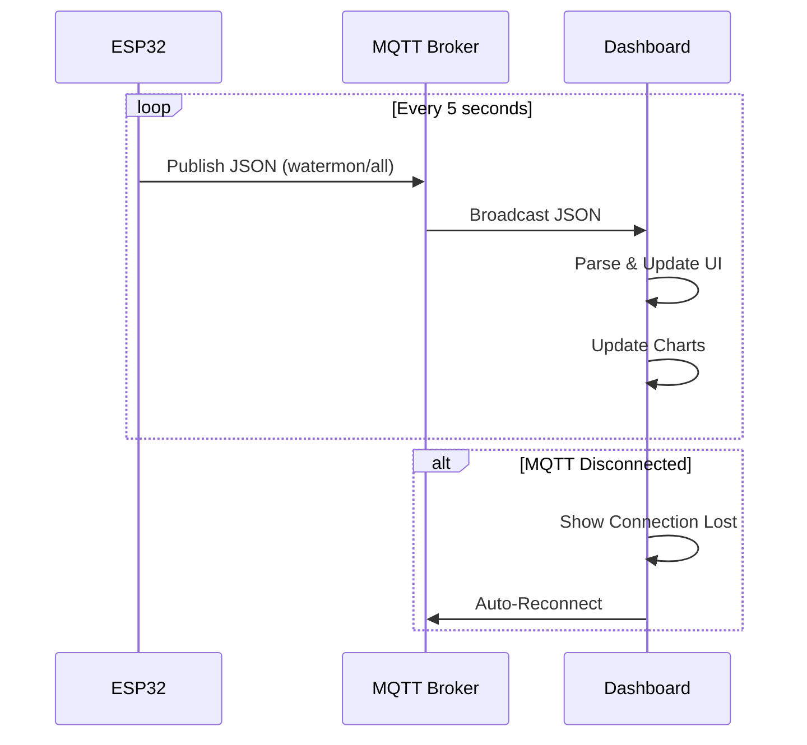

# 📄 README.md - DASHBOARD

<h1 align="center">💧 SMART RO WATER QUALITY MONITOR</h1>

<p align="center">
  
</p>

<p align="center">
  <em>Dashboard monitoring kualitas air RO real-time berbasis MQTT</em>
</p>

<p align="center">
  
  
  
  
  
  
  <a href="LICENSE">
    
  </a>
</p>

---

## 📑 Daftar Isi
- [✨ Overview](#-overview)
- [🌐 Live Demo](#-live-demo)
- [📊 Parameter yang Dimonitor](#-parameter-yang-dimonitor)
- [🎯 Fitur Dashboard](#-fitur-dashboard)
- [🏗️ System Architecture](#%EF%B8%8F-system-architecture)
- [📁 Project Structure](#-project-structure)
- [⚙️ Installation](#%EF%B8%8F-installation)
- [🚀 Usage](#-usage)
- [📦 Dependencies](#-dependencies)
- [🔧 Configuration](#-configuration)
- [🐞 Troubleshooting](#-troubleshooting)
- [🤝 Contributing](#-contributing)
- [📄 License](#-license)

---

## ✨ Overview

**Smart RO Water Quality Monitor Dashboard** adalah antarmuka web untuk memonitor kualitas air Reverse Osmosis secara real-time. Data diterima dari ESP32 melalui MQTT dan ditampilkan dalam dashboard modern dengan grafik interaktif.

### 🎯 Cara Kerja
1. **ESP32** membaca sensor dan mengirim data ke MQTT
2. **Dashboard** subscribe ke topic MQTT
3. **Data** ditampilkan secara real-time
4. **Grafik** menunjukkan tren pH dan TDS
5. **Alert** muncul jika kualitas air menurun

---

## 🌐 Live Demo

👉 **[Buka Smart RO Console](https://wahyukurniaw4an.github.io/ro-monitoringg/)**

---

## 📊 Parameter yang Dimonitor

| Parameter | Display | Rentang Normal | Sumber Data |
|-----------|---------|----------------|-------------|
| **pH** | 0.00 - 14.00 | 6.5 - 9.8 | `data.ph` |
| **TDS** | 0 - 9999 ppm | < 500 ppm | `data.tds` |
| **Turbidity** | 0 - 100 NTU | < 5 NTU | `data.turbidity_ntu` |
| **Temperature** | -55 - 125 °C | 15 - 35 °C | `data.temperature` |
| **Volume** | 0 - ∞ L | - | `data.volume` |
| **Filter Health** | 0 - 100% | > 70% | `data.health` |
| **Days Left** | 0 - ∞ | - | `data.days_left` |
| **Flow Rate** | 0 - ∞ L/min | - | `data.flow_rate` |

### 🏷️ Badge Status

| Parameter | Optimal | Warning | Kritis |
|-----------|---------|---------|--------|
| **pH** | 🟢 OPTIMAL | 🟡 WARNING | 🔴 DANGER |
| **TDS** | 🟢 PURE | 🟡 HIGH TDS | 🔴 VERY HIGH |
| **Turbidity** | 🟢 CLEAR | 🟡 CLOUDY | 🔴 DIRTY |
| **Temperature** | 🟢 NOMINAL | 🟡 WARN | 🔴 ALERT |

---

## 🎯 Fitur Dashboard

### ✅ Real-time Monitoring
- Data update setiap 5 detik via MQTT
- Status koneksi MQTT real-time
- Indikator ESP32 online/offline

### ✅ Interactive Charts
- Grafik pH (0-14) dengan Chart.js
- Grafik TDS (0-500 ppm) dengan Chart.js
- Rolling data 20 titik terakhir
- Tooltip interaktif

### ✅ Water Quality Status
- Status LAYAK / TIDAK LAYAK
- Ikon visual (✅ / ⚠️ / ❌)
- Penjelasan detail status

### ✅ Filter Health Monitor
- Estimasi umur filter (0-100%)
- Progress bar dengan warna indikator
- Estimasi hari tersisa

### ✅ Volume Tracking
- Total produksi air dalam Liter
- Debit air (L/min)
- Tracking kumulatif

### ✅ Filter Replacement Logic
- Status penggantian filter
- Skor filter berdasarkan 3 parameter
- Alasan dan rekomendasi

### ✅ Responsive Design
- Mobile & Desktop friendly
- Dark theme dengan efek glassmorphism
- Grid layout adaptif

---

## 🏗️ System Architecture

```text
┌───────────────────────────────────────────────────────────────┐
│                      GITHUB PAGES                             │
│                 (https://user.github.io/ro)                   │
│  ┌────────────────────────────────────────────────────────┐   │
│  │                    WEB DASHBOARD                       │   │
│  │  ┌───────────────┐  ┌───────────────┐  ┌────────────┐  │   │
│  │  │  Water Status │  │ Filter Health │  │   Charts   │  │   │
│  │  └───────────────┘  └───────────────┘  └────────────┘  │   │
│  │  ┌───────────────┐  ┌───────────────┐  ┌────────────┐  │   │
│  │  │  pH / TDS     │  │ Turbidity/Temp│  │  Volume    │  │   │
│  │  └───────────────┘  └───────────────┘  └────────────┘  │   │
│  └────────────────────────────────────────────────────────┘   │
└───────────────────────────────────────────────────────────────┘
                                    │
                                    │ MQTT over WebSocket (WSS)
                                    ▼
┌────────────────────────────────────────────────────────────────┐
│                      MQTT BROKER (HiveMQ)                      │
│                    broker.hivemq.com:8884                      │
│                   Topic: watermon/all                          │
└────────────────────────────────────────────────────────────────┘
                                    │
                                    │ MQTT over TCP
                                    ▼
┌────────────────────────────────────────────────────────────────┐
│                            ESP32                               │
│  ┌─────────────────────────────────────────────────────────┐   │
│  │                     SENSORS                             │   │
│  │  pH, TDS, Turbidity, Temperature, Flow                  │   │
│  └─────────────────────────────────────────────────────────┘   │
└────────────────────────────────────────────────────────────────┘
```

### Data Flow


---

## 📁 Project Structure

```text
smart-ro-monitor/
├── 📄 index.html                 # Main Dashboard
├── 📜 script.js                  # MQTT + Logic
├── 🎨 style.css                  # Styling & Responsive
├── 📄 README.md                  # Dokumentasi
├── 📁 assets/                    # Gambar & screenshot
└── 📁 esp32/                     # ESP32 Firmware
    ├── 📄 smart_ro_monitor.ino
    └── 📄 water_rules.h
```

---

## ⚙️ Installation

### 1. Clone Repository
```bash
git clone https://github.com/username/smart-ro-monitor.git
cd smart-ro-monitor
```

### 2. Deploy ke GitHub Pages

**Option A: Auto Deploy**
1. Upload semua file ke repository GitHub
2. Buka **Settings** → **Pages**
3. Pilih **Source**: `Deploy from a branch` → `main` → `/ (root)`
4. Simpan
5. Tunggu 1-2 menit
6. Akses: `https://username.github.io/smart-ro-monitor`

**Option B: Local Development**
```bash
# Python
python -m http.server 8080

# Node.js
npx http-server . -p 8080

# PHP
php -S localhost:8080
```

### 3. ESP32 Setup
1. Upload `esp32/smart_ro_monitor.ino` ke ESP32
2. Setup WiFi melalui hotspot `WaterMonitor`
3. ESP32 akan otomatis publish data ke MQTT

---

## 🚀 Usage

### Dashboard
1. **Buka Dashboard** di browser
2. **Tunggu koneksi MQTT** (< 10 detik)
3. **Data akan muncul** secara real-time

### Connection Status
| Status | Warna | Arti |
|--------|-------|------|
| SYSTEM ONLINE | 🟢 | MQTT Terhubung |
| CONNECTION LOST | 🔴 | MQTT Terputus |
| AWAITING NODE | 🟡 | Menunggu data ESP32 |

### Interpretasi Data
| Status | Arti | Tindakan |
|--------|------|----------|
| SAFE TO DRINK | ✅ Air layak konsumsi | Lanjutkan pemantauan |
| CAUTION | ⚠️ Parameter mendekati batas | Periksa sensor & filter |
| NOT SAFE | ❌ Air tidak layak | Jangan konsumsi, cek sistem |

---

## 📦 Dependencies

### Frontend (CDN)
| Library | Version | Purpose |
|---------|---------|---------|
| [Chart.js](https://www.chartjs.org/) | 4.4.1 | Grafik real-time |
| [MQTT.js](https://github.com/mqttjs/MQTT.js) | 5.0.0 | MQTT over WebSocket |
| [Font Awesome](https://fontawesome.com/) | 6.5.0 | Ikon |
| [Google Fonts](https://fonts.google.com/) | - | Outfit & JetBrains Mono |

### ESP32 (Arduino)
| Library | Purpose |
|---------|---------|
| `WiFiManager` | WiFi setup via captive portal |
| `PubSubClient` | MQTT communication |
| `LiquidCrystal_I2C` | LCD 20x4 display |
| `DallasTemperature` | DS18B20 temperature sensor |
| `OneWire` | 1-Wire communication |

---

## 🔧 Configuration

### MQTT Configuration
```javascript
// script.js
const MQTT_BROKER = "wss://broker.hivemq.com:8884/mqtt";
const MQTT_TOPIC = "watermon/all";
```

### ESP32 Configuration
```cpp
// smart_ro_monitor.ino
#define MQTT_BROKER "broker.hivemq.com"
#define MQTT_PORT 1883
#define MQTT_CLIENT_ID "esp32-ro-monitor-001"
#define MQTT_TOPIC_ALL "watermon/all"
```

### Filter Replacement Parameters
```cpp
// water_rules.h
const float MAX_VOLUME_LITER = 30000.0;  // 30.000 liter
// Bobot: Volume 50%, TDS 50%
// pH hanya sebagai info (bukan indikator kerusakan filter)
```

---

## 🐞 Troubleshooting

### Dashboard Tidak Connect
| Masalah | Solusi |
|---------|--------|
| MQTT offline | Cek koneksi internet |
| ESP32 tidak publish | Cek power & WiFi ESP32 |
| WebSocket error | Refresh halaman / clear cache |
| Tracking Prevention | Gunakan browser lain / nonaktifkan |

### Data Tidak Muncul
| Masalah | Solusi |
|---------|--------|
| JSON parse error | Buka Console Browser (F12) |
| Topic salah | Cek `watermon/all` |
| ESP32 offline | Periksa Serial Monitor |
| Payload terlalu besar | Update ESP32 dengan versi minimal |

### Tampilan Rusak
| Masalah | Solusi |
|---------|--------|
| Font Awesome tidak load | Ganti CDN ke `cdnjs` |
| CSS tidak apply | Clear cache browser |
| Chart tidak muncul | Cek Console untuk error |

### Debug Mode
```javascript
// Buka Console Browser (F12)
// Cek state
console.log(debug.state);

// Cek data terakhir
console.log(debug.state.lastData);

// Cek DOM
console.log(debug.DOM);
```

---

## 🤝 Contributing

Kontribusi sangat diterima! 

### Cara Berkontribusi
1. **Fork** repository ini
2. **Create** feature branch (`git checkout -b feature/NewFeature`)
3. **Commit** changes (`git commit -m 'Add NewFeature'`)
4. **Push** to branch (`git push origin feature/NewFeature`)
5. **Open** Pull Request

### Area Pengembangan
- [ ] Tambah grafik turbidity & temperature
- [ ] Export data ke CSV
- [ ] Notifikasi push (Telegram/WhatsApp)
- [ ] Multi-ESP32 support
- [ ] Data logging historis
- [ ] Dark/Light theme toggle

---

## 📄 License

MIT License © 2026

```text
MIT License

Copyright (c) 2026

Permission is hereby granted, free of charge, to any person obtaining a copy
of this software and associated documentation files (the "Software"), to deal
in the Software without restriction, including without limitation the rights
to use, copy, modify, merge, publish, distribute, sublicense, and/or sell
copies of the Software, and to permit persons to whom the Software is
furnished to do so, subject to the following conditions:
```

---

<div align="center">

**💧 Smart RO Water Quality Monitoring System**  
**Built with ESP32 • MQTT • GitHub Pages**

⭐ **Star this repo if you like it!**

<p><a href="#top">⬆ Kembali ke Atas</a></p>

</div>
