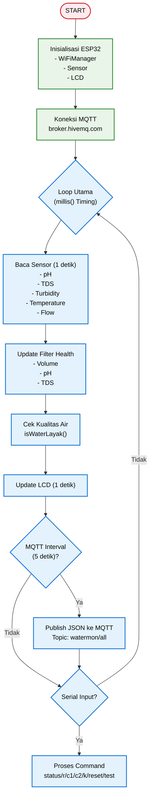

# 📄 README.md - Dashboard

<h1 align="center">💧 SMART RO WATER QUALITY MONITOR</h1>

<p align="center">
  
  
  
  
  
  
</p>

<p align="center">
  <em>Sistem Monitoring Kualitas Air RO Real-time berbasis ESP32 + MQTT</em>
</p>

---

## 📑 Daftar Isi
- [✨ Overview](#-overview)
- [🔧 Features](#-features)
- [🏗️ System Architecture](#%EF%B8%8F-system-architecture)
- [📁 Project Structure](#-project-structure)
- [⚙️ Installation](#%EF%B8%8F-installation)
- [🚀 Usage](#-usage)
- [🧪 Testing](#-testing)
- [📦 Dependencies](#-dependencies)
- [🔧 Configuration](#-configuration)
- [🐞 Troubleshooting](#-troubleshooting)
- [📄 License](#-license)

---

## ✨ Overview

**Smart RO Water Quality Monitor** adalah sistem monitoring kualitas air Reverse Osmosis secara real-time menggunakan ESP32. Sistem ini memantau parameter penting seperti pH, TDS, Kekeruhan, Suhu, dan Volume produksi, kemudian menampilkan status "LAYAK" atau "TIDAK LAYAK" melalui dashboard web yang dapat diakses dari mana saja.

## 🌐 Live Dashboard

👉 [Open Smart RO Console](https://wahyukurniaw4an.github.io/ro-monitoringg/)

### 🎯 Fitur Utama
- Monitoring 5 parameter sensor secara simultan
- Penilaian otomatis kualitas air (Rule-based)
- Dashboard real-time dengan grafik
- Kesehatan filter otomatis
- Komunikasi MQTT dua arah

### 📊 Parameter yang Dimonitor
| Parameter | Rentang Normal | Sensor |
|-----------|---------------|--------|
| **pH** | 6.5 - 9.8 | pH Meter Analog |
| **TDS** | < 500 ppm | TDS Meter Analog |
| **Turbidity** | < 5 NTU | Turbidity Sensor |
| **Temperature** | 15 - 35 °C | DS18B20 |
| **Flow Rate** | - | Flow Sensor YF-S201 |
| **Volume** | - | Flow Sensor (kumulatif) |

---

## 🔧 Features

### ✅ Dashboard Features
- **Real-time Monitoring** – Data update setiap 5 detik via MQTT
- **Interactive Charts** – Grafik pH & TDS dengan Chart.js
- **Water Quality Status** – Status LAYAK / TIDAK LAYAK dengan ikon
- **Filter Health Monitor** – Estimasi umur filter (0-100%)
- **Volume Tracking** – Total produksi air dalam Liter
- **Responsive Design** – Mobile & Desktop friendly
- **Dark Theme** – Desain modern dengan efek glassmorphism

### ✅ ESP32 Features
- **Multi-Sensor Integration** – pH, TDS, Turbidity, Temperature, Flow
- **Auto Calibration** – Kalibrasi pH & turbidity via Serial
- **Flow Calibration** – Kalibrasi flow sensor (c1/c2/k)
- **Filter Replacement Logic** – 3 parameter: Volume, pH, TDS
- **WiFiManager** – Setup WiFi via captive portal
- **MQTT Communication** – Publish data ke HiveMQ broker
- **LCD Display** – Tampilan minimalis 20x4 I2C LCD
- **Buzzer Alert** – Notifikasi saat filter perlu diganti

---

## 🏗️ System Architecture

```text
┌─────────────────────────────────────────────────────────────────┐
│                         GITHUB PAGES                           │
│                    (https://user.github.io/ro)                 │
│  ┌─────────────────────────────────────────────────────────┐   │
│  │                    WEB DASHBOARD                        │   │
│  │  ┌───────────────┐  ┌───────────────┐  ┌────────────┐  │   │
│  │  │  Water Status │  │ Filter Health │  │   Charts   │  │   │
│  │  └───────────────┘  └───────────────┘  └────────────┘  │   │
│  │  ┌───────────────┐  ┌───────────────┐  ┌────────────┐  │   │
│  │  │  pH / TDS     │  │ Turbidity/Temp│  │  Volume    │  │   │
│  │  └───────────────┘  └───────────────┘  └────────────┘  │   │
│  └─────────────────────────────────────────────────────────┘   │
└─────────────────────────────────────────────────────────────────┘
                                    │
                                    │ MQTT over WebSocket (WSS)
                                    ▼
┌─────────────────────────────────────────────────────────────────┐
│                      MQTT BROKER (HiveMQ)                      │
│                    broker.hivemq.com:8884                      │
│                   Topic: watermon/all                         │
└─────────────────────────────────────────────────────────────────┘
                                    │
                                    │ MQTT over TCP
                                    ▼
┌─────────────────────────────────────────────────────────────────┐
│                            ESP32                               │
│  ┌─────────────────────────────────────────────────────────┐   │
│  │                     SENSORS                             │   │
│  │  ┌────────────┐ ┌────────────┐ ┌────────────────────┐  │   │
│  │  │ pH Sensor  │ │ TDS Sensor │ │ Turbidity Sensor   │  │   │
│  │  │   (GPIO32) │ │   (GPIO33) │ │    (GPIO35)        │  │   │
│  │  └────────────┘ └────────────┘ └────────────────────┘  │   │
│  │  ┌────────────┐ ┌────────────┐ ┌────────────────────┐  │   │
│  │  │ DS18B20    │ │ Flow Sensor│ │ 20x4 I2C LCD       │  │   │
│  │  │  (GPIO18)  │ │  (GPIO19)  │ │  (0x27)            │  │   │
│  │  └────────────┘ └────────────┘ └────────────────────┘  │   │
│  └─────────────────────────────────────────────────────────┘   │
│                                                                 │
│  ┌─────────────────────────────────────────────────────────┐   │
│  │                FILTER REPLACEMENT LOGIC                 │   │
│  │  ┌──────────────┐  ┌──────────────┐  ┌──────────────┐ │   │
│  │  │   VOLUME     │  │      pH      │  │     TDS      │ │   │
│  │  │ (Max 30.000L)│  │ (6.5 - 9.8)  │  │  (< 50 ppm)  │ │   │
│  │  └──────────────┘  └──────────────┘  └──────────────┘ │   │
│  │                     ↓                                   │   │
│  │  ┌────────────────────────────────────────────────────┐ │   │
│  │  │  DECISION: GANTI FILTER / PERSIAPAN / OK          │ │   │
│  │  └────────────────────────────────────────────────────┘ │   │
│  └─────────────────────────────────────────────────────────┘   │
└─────────────────────────────────────────────────────────────────┘
```

### Flowchart Sistem



---

## 📁 Project Structure

```text
smart-ro-monitor/
├── 📄 index.html                 # Main Dashboard
├── 📜 script.js                  # MQTT + Logic
├── 🎨 style.css                  # Styling & Responsive
├── 📄 README.md                  # Dokumentasi Dashboard
├── 📁 esp32/
│   ├── 📄 smart_ro_monitor.ino   # Kode Arduino ESP32
│   └── 📄 water_rules.h          # Aturan kualitas air & filter
└── 📁 assets/                    # (opsional) Gambar & screenshot
```

---

## ⚙️ Installation

### 1. Clone Repository
```bash
git clone https://github.com/username/smart-ro-monitor.git
cd smart-ro-monitor
```

### 2. Deploy ke GitHub Pages
1. Upload semua file ke repository GitHub
2. Buka **Settings** → **Pages**
3. Pilih **Source**: `Deploy from a branch` → `main` → `/ (root)`
4. Simpan
5. Tunggu beberapa menit, lalu akses di:
   `https://username.github.io/smart-ro-monitor`

### 3. Upload ke ESP32
1. Buka `esp32/smart_ro_monitor.ino` di Arduino IDE
2. Install library:
   - `WiFiManager`
   - `PubSubClient`
   - `LiquidCrystal_I2C`
   - `DallasTemperature`
   - `OneWire`
3. Upload sketch ke ESP32
4. Hubungkan ke WiFi melalui hotspot `WaterMonitor`

---

## 🚀 Usage

### Dashboard Usage
1. **Nyalakan ESP32**
2. **Buka Dashboard** di browser
3. **Tunggu koneksi MQTT** (biasanya < 10 detik)
4. Monitoring real-time akan muncul otomatis

### ESP32 Commands (via Serial Monitor)
| Command | Fungsi |
|---------|--------|
| `status` | Tampilkan semua data sensor & filter |
| `r` | Reset volume air |
| `c1` | Start kalibrasi flow 1 Liter |
| `c2` | Start kalibrasi flow 2 Liter |
| `k` | Finish kalibrasi flow |
| `reset` | Reset filter health |
| `test` | Test buzzer |
| `turb` | Debug turbidity sensor |
| `cal_turb` | Kalibrasi turbidity sensor |

### Dashboard Parameters
| Parameter | Display | Description |
|-----------|---------|-------------|
| **pH** | 0.00 - 14.00 | Keasaman air |
| **TDS** | 0 - 9999 ppm | Total Dissolved Solids |
| **Turbidity** | 0 - 100 NTU | Kekeruhan air |
| **Temperature** | -55 - 125 °C | Suhu air |
| **Volume** | 0 - ∞ L | Total produksi air |
| **Filter Health** | 0 - 100% | Kesehatan filter |
| **Days Left** | 0 - ∞ | Estimasi hari tersisa |

---

## 🧪 Testing

### Test Dashboard Connection
1. Buka Console Browser (`F12`)
2. Periksa status MQTT: `SYSTEM ONLINE`
3. Periksa data incoming: `RX: X PKT`

### Test ESP32 Sensors
```bash
# Serial Monitor
status

# Expected Output:
║ pH          :   7.12                ║
║ TDS         :    45 ppm           ║
║ Temperature :   26.50 °C            ║
║ Turbidity   :    2.34 NTU (JERNIH) ║
```

### Test Filter Replacement Logic
```bash
# Simulasikan volume tinggi
# Reset filter dengan command reset
# Pantau status filter di dashboard
```

---

## 📦 Dependencies

### Frontend (Dashboard)
| Library | Version | Purpose |
|---------|---------|---------|
| [Chart.js](https://www.chartjs.org/) | 4.4.1 | Grafik real-time |
| [MQTT.js](https://github.com/mqttjs/MQTT.js) | 5.0.0 | MQTT over WebSocket |
| [Tailwind CSS](https://tailwindcss.com/) | 3.4.0 | Styling framework |
| Google Fonts | - | Outfit & JetBrains Mono |

### ESP32 (Arduino)
| Library | Purpose |
|---------|---------|
| `WiFiManager` | WiFi setup via captive portal |
| `PubSubClient` | MQTT communication |
| `LiquidCrystal_I2C` | LCD 20x4 display |
| `DallasTemperature` | DS18B20 temperature sensor |
| `OneWire` | 1-Wire communication |
| `Preferences` | Non-volatile storage |

---

## 🔧 Configuration

### MQTT Configuration
```javascript
// script.js
const MQTT_BROKER = "wss://broker.hivemq.com:8884/mqtt";
const MQTT_TOPIC = "watermon/all";
```

### ESP32 Configuration
```cpp
// smart_ro_monitor.ino
#define MQTT_BROKER "broker.hivemq.com"
#define MQTT_PORT 1883
#define MQTT_CLIENT_ID "esp32-ro-monitor-001"
#define MQTT_TOPIC_ALL "watermon/all"
```

### Filter Replacement Parameters
```cpp
// water_rules.h
const float MAX_VOLUME_LITER = 30000.0;  // 30.000 liter
// pH: 6.5 - 9.8
// TDS Ideal: < 50 ppm
// Bobot: Volume 40%, pH 30%, TDS 30%
```

---

## 🐞 Troubleshooting

### Dashboard Tidak Connect
| Masalah | Solusi |
|---------|--------|
| MQTT offline | Cek koneksi internet |
| ESP32 tidak publish | Cek power & WiFi ESP32 |
| WebSocket error | Refresh halaman / clear cache |

### Data Tidak Muncul
| Masalah | Solusi |
|---------|--------|
| JSON parse error | Buka Console Browser (F12) |
| Topic salah | Cek `watermon/all` |
| ESP32 offline | Periksa Serial Monitor |

### ESP32 WiFi Gagal
| Masalah | Solusi |
|---------|--------|
| Hotspot tidak muncul | Reset WiFiManager |
| Password salah | Ulangi setup WiFi |
| Router 5GHz | Gunakan 2.4GHz only |

### Sensor Error
| Sensor | Masalah | Solusi |
|--------|---------|--------|
| pH | Nilai stabil | Kalibrasi ulang |
| TDS | ADC rendah | Periksa koneksi |
| Turbidity | ADC < 1000 | Bersihkan sensor |
| Flow | Pulse tidak terbaca | Cek kabel interrupt |

---

## 📄 License

Proyek ini open source di bawah lisensi **MIT**.

---

<div align="center">
  <strong>💧 Smart RO Water Quality Monitoring System</strong><br>
  Built with ESP32 • MQTT • GitHub Pages
  <p><a href="#top">⬆ Kembali ke Atas</a></p>
</div>
