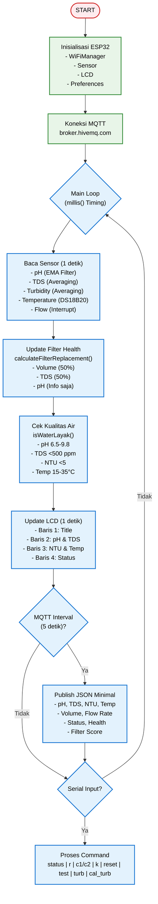
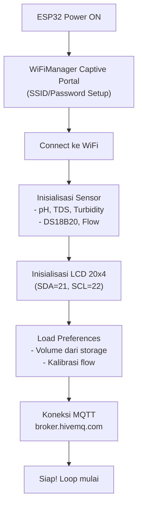

# 📄 README.md - ESP32 FIRMWARE

<h1 align="center">💧 ESP32 RO Water Quality Monitor<br>
    <sub>Smart Reverse Osmosis Monitoring System</sub>
</h1>

<p align="center">
  
</p>

<p align="center">
  <em>Sistem monitoring kualitas air Reverse Osmosis berbasis ESP32 dengan 5 sensor, LCD, MQTT, dan logika penggantian filter otomatis.</em>
</p>

<p align="center">
  
  
  
  
  
  
  <a href="LICENSE">
    
  </a>
</p>

---

## 📋 Daftar Isi
- [✨ Overview](#-overview)
- [🔧 Features](#-features)
- [📸 Demo Sistem](#-demo-sistem)
- [🧩 Komponen Utama](#-komponen-utama-dan-fungsinya)
- [💻 Software & Library](#-software--library)
- [🏗️ Arsitektur Sistem](#%EF%B8%8F-arsitektur-sistem)
- [🔄 Alur Kerja](#-alur-kerja-sistem)
- [⚙️ Instalasi](#%EF%B8%8F-instalasi)
- [🚀 Cara Menjalankan](#-cara-menjalankan)
- [📊 Data MQTT](#-data-mqtt)
- [🧪 Testing](#-testing)
- [🐞 Troubleshooting](#-troubleshooting)
- [🤝 Kontribusi](#-kontribusi)
- [📄 Lisensi](#-lisensi)

---

## ✨ Overview

**ESP32 RO Water Quality Monitor** adalah sistem monitoring kualitas air Reverse Osmosis (RO) yang menggunakan ESP32 untuk membaca 5 sensor sekaligus: pH, TDS, Turbidity, Temperature, dan Flow. Data dikirim secara real-time via MQTT ke dashboard web, dan dilengkapi dengan logika penggantian filter otomatis berdasarkan 3 parameter.

### 🎯 Cara Kerja
1. **Baca Sensor** → ESP32 membaca 5 sensor setiap 1 detik
2. **Proses Data** → Hitung filter health berdasarkan Volume dan TDS
3. **Kirim MQTT** → Data dikirim ke broker MQTT setiap 5 detik
4. **Tampilkan LCD** → Informasi kualitas air ditampilkan di LCD 20x4
5. **Dashboard Web** → Data ditampilkan secara real-time di dashboard

### 🔧 Fitur Utama
- ✅ **5 Sensor Terintegrasi** – pH, TDS, Turbidity, Temperature, Flow  
- ✅ **Filter Replacement Logic** – 3 parameter: Volume (50%), TDS (50%)  
- ✅ **WiFi Auto-Connect** – Setup mudah via WiFiManager  
- ✅ **MQTT Communication** – Kirim data ke cloud real-time  
- ✅ **LCD Display** – Tampilan minimalis 20x4  
- ✅ **Non-Blocking Loop** – Timing presisi via millis()  
- ✅ **Buzzer Alert** – Notifikasi saat filter perlu diganti  
- ✅ **Persistent Storage** – Simpan volume & kalibrasi di Preferences  

---

## 📸 Demo Sistem

### Tampilan LCD
```
┌────────────────────┐
│ SMART RO MONITOR WM│  <- W=WiFi, M=MQTT
│ pH 7.12 TDS  45    │  <- pH & TDS
│ 2.34NTU 26.5C      │  <- Turbidity & Temperature
│ STATUS: LAYAK      │  <- Water quality status
└────────────────────┘
```

### Tampilan Serial Monitor
```
╔═══════════════════════════════════════╗
║ SYSTEM STATUS                         ║
╠═══════════════════════════════════════╣
║ pH          :   7.12                  ║
║ TDS         :    45 ppm               ║
║ Temperature :   26.50 °C              ║
║ Turbidity   :    2.34 NTU (JERNIH)    ║ 
╠═══════════════════════════════════════╣
║ Volume      :   125.500 L             ║
║ Flow Rate   :     2.50 L/min          ║
╠═══════════════════════════════════════╣
║ Status      : LAYAK                   ║
║ Filter      :     85 %                ║
║ Days Left   :     22                  ║
╠═══════════════════════════════════════╣
║ FILTER REPLACEMENT STATUS             ║
╠═══════════════════════════════════════╣
║ Need Replace: TIDAK 🟢               ║
║ Reason      : Skor filter: 85%        ║
║ Recomendasi : Filter masih baik       ║
╚═══════════════════════════════════════╝
```

### 📊 Live Dashboard
👉 **[Buka Smart RO Console](https://wahyukurniaw4an.github.io/ro-monitoringg/)**

---

## 🧩 Komponen Utama dan Fungsinya

| Komponen | Fungsi | GPIO |
|----------|--------|------|
| **ESP32 DevKit** | Otak utama sistem | - |
| **pH Meter Analog** | Mengukur pH air | GPIO 32 |
| **TDS Meter Analog** | Mengukur Total Dissolved Solids | GPIO 33 |
| **Turbidity Sensor** | Mengukur kekeruhan air | GPIO 35 |
| **DS18B20** | Mengukur suhu air | GPIO 18 |
| **Flow Sensor YF-S201** | Mengukur debit & volume | GPIO 19 |
| **LCD 20x4 I2C** | Tampilan lokal | SDA=21, SCL=22 |
| **Buzzer** | Alert/notifikasi | GPIO 2 |

### Diagram Wiring
```
ESP32 DevKit
├─ GPIO 32 ──── pH Sensor (Analog)
├─ GPIO 33 ──── TDS Sensor (Analog)
├─ GPIO 35 ──── Turbidity Sensor (Analog)
├─ GPIO 18 ──── DS18B20 (1-Wire)
├─ GPIO 19 ──── Flow Sensor (Interrupt)
├─ GPIO 21 ──── LCD SDA (I2C)
├─ GPIO 22 ──── LCD SCL (I2C)
├─ GPIO 2  ──── Buzzer
├─ 3.3V   ──── Sensor VCC
└─ GND    ──── Sensor GND
```

---

## 💻 Software & Library

### Library yang Dibutuhkan
| Library | Instalasi |
|---------|-----------|
| **WiFiManager** by tzapu | Library Manager |
| **PubSubClient** by Nick O'Leary | Library Manager |
| **LiquidCrystal_I2C** by Frank de Brabander | Library Manager |
| **OneWire** by Paul Stoffregen | Library Manager |
| **DallasTemperature** by Miles Burton | Library Manager |

### Cara Install Library
```
Sketch → Include Library → Manage Libraries
Cari dan install masing-masing library di atas
```

---

## 🏗️ Arsitektur Sistem

### Diagram Blok Sistem
```
              ┌─────────────────────────┐
              │   MQTT Broker (HiveMQ)  │
              │   Topic: watermon/all   │
              └───────────┬─────────────┘
                          │ MQTT (TCP)
                          ▼
            ┌────────────────────────────────────────────┐
            │          ESP32 (Arduino Loop)              │
            │────────────────────────────────────────────│
            │ - millis() Timing                          │
            │ - Sensor Read (pH, TDS, Turb, Temp, Flow)  │
            │ - Filter Health Calculation                │
            │ - MQTT Publish                             │
            │ - LCD Update                               │
            └──────────┬─────────────────────────────────┘
                       │
         ┌─────────────┼─────────────────────────────────┐
         │             │                                 │
         ▼             ▼                                 ▼
┌─────────────────┐ ┌─────────────────┐ ┌─────────────────────┐
│  LCD 20x4 I2C   │ │  Buzzer (GPIO2) │ │ Flow Sensor (GPIO19)│
│  (SDA=21,SCL=22)│ └─────────────────┘ │  (Interrupt)        │
└─────────────────┘                     └─────────────────────┘
         │
         ▼
┌────────────────────────────────────────────────────────────┐
│                         SENSORS                            │
│  ┌──────────────┐ ┌──────────────┐ ┌────────────────────┐  │
│  │ pH (GPIO32)  │ │ TDS (GPIO33) │ │ Turbidity (GPIO35) │  │
│  │ ADC 12-bit   │ │ ADC 12-bit   │ │ ADC 12-bit         │  │
│  └──────────────┘ └──────────────┘ └────────────────────┘  │
│  ┌────────────────────────────────────────────────────┐    │
│  │ DS18B20 (GPIO18) - 1-Wire Temperature              │    │
│  └────────────────────────────────────────────────────┘    │
└────────────────────────────────────────────────────────────┘
```

### Flowchart Sistem


---

## 🔄 Alur Kerja Sistem

### 1. Inisialisasi Sistem


### 2. Pembacaan Sensor
```
if (now - lastSensorRead >= SENSOR_INTERVAL) {
  // pH: 20 samples averaging + EMA filter
  phValue = calculatePH(voltage);
  
  // TDS: 20 samples averaging
  tdsValue = calculateTDS_DFRobot(voltage, temperature);
  
  // Turbidity: 20 samples averaging
  turbidityNTU = adcToNTU(avgADC);
  
  // Temperature: DS18B20
  temperatureC = ds18b20.getTempCByIndex(0);
  
  // Flow: Update volume & flow rate
  updateFlow();
  
  // Filter Health: 3 parameters
  filterHealthResult = calculateFilterReplacement(volume, ph, tds);
}
```

### 3. Filter Replacement Logic
```
Parameter 1: Volume (50% bobot)
  - < 15.000L → 100%
  - 15.000 - 27.000L → 30-70%
  - > 27.000L → 0-30%

Parameter 2: TDS (50% bobot) - INDIKATOR UTAMA
  - < 30 ppm → 100%
  - 30 - 50 ppm → 80%
  - 50 - 100 ppm → 50%
  - 100 - 200 ppm → 20%
  - > 200 ppm → 0% (KRITIS - MEMBRAN RUSAK!)

Parameter 3: pH (INFO SAJA - BUKAN INDIKATOR KERUSAKAN)
  - 7.0 - 8.5 → Normal
  - 6.5 - 7.0 atau 8.5 - 9.8 → Mendekati batas
  - < 6.5 atau > 9.8 → Peringatan (cek sumber air)

Keputusan:
  - Jika TDS > 200 ppm atau Volume > 30.000L → SEGERA GANTI
  - Total skor < 40% → Ganti
  - Total skor 40-60% → Persiapan
  - Total skor > 60% → OK
```

---

## ⚙️ Instalasi

### 1. Clone Repository
```bash
git clone https://github.com/username/smart-ro-monitor.git
cd smart-ro-monitor/esp32
```

### 2. Setup Arduino IDE

#### Install ESP32 Board Package
1. Buka Arduino IDE
2. File → Preferences
3. Tambahkan URL di "Additional Boards Manager URLs":
   ```
   https://raw.githubusercontent.com/espressif/arduino-esp32/gh-pages/package_esp32_index.json
   ```
4. Tools → Board Manager → Cari "ESP32" → Install (versi 2.0.14+)

#### Install Required Libraries
Buka Arduino IDE → Sketch → Include Library → Manage Libraries, cari dan install:
- **WiFiManager** by tzapu
- **PubSubClient** by Nick O'Leary
- **LiquidCrystal_I2C** by Frank de Brabander
- **OneWire** by Paul Stoffregen
- **DallasTemperature** by Miles Burton

### 3. Upload ke ESP32
```
1. Hubungkan ESP32 ke PC via USB
2. Tools → Board → ESP32 Dev Module
3. Tools → Port → Pilih port ESP32
4. Sketch → Upload
5. Monitor Serial (Baud: 115200) untuk melihat log
```

---

## 🚀 Cara Menjalankan

### 1. Setup WiFi (Pertama Kali)
```
1. ESP32 akan buat hotspot "WaterMonitor"
2. Connect ke hotspot (password: water123)
3. Buka browser → 192.168.4.1
4. Pilih WiFi rumah → Masukkan password → Save
5. ESP32 akan connect & reboot
```

### 2. Kalibrasi Sensor
| Command | Fungsi |
|---------|--------|
| `cal_turb` | Kalibrasi sensor turbidity |
| `c1` | Start kalibrasi flow 1L |
| `c2` | Start kalibrasi flow 2L |
| `k` | Finish kalibrasi flow |

### 3. Perintah Serial
| Command | Fungsi |
|---------|--------|
| `status` | Tampilkan semua data sensor |
| `r` | Reset volume air |
| `reset` | Reset filter health |
| `test` | Test buzzer |
| `turb` | Debug turbidity |

---

## 📊 Data MQTT

### Topic
```
watermon/all
```

### JSON Payload (Minimal Version)
```json
{
  "ph": 7.12,
  "tds": 45,
  "turbidity_ntu": 2.34,
  "temperature": 26.50,
  "status": "LAYAK",
  "health": 85,
  "days_left": 22,
  "volume": 125.500,
  "flow_rate": 2.50,
  "filter_need_replacement": false,
  "filter_score": 85,
  "ph_warning": false
}
```

### Field Description
| Field | Type | Deskripsi |
|-------|------|-----------|
| `ph` | float | Nilai pH air |
| `tds` | float | Total Dissolved Solids (ppm) |
| `turbidity_ntu` | float | Kekeruhan air (NTU) |
| `temperature` | float | Suhu air (°C) |
| `status` | string | LAYAK / TIDAK LAYAK |
| `health` | float | Kesehatan filter (%) |
| `days_left` | int | Estimasi hari tersisa |
| `volume` | float | Total volume air (L) |
| `flow_rate` | float | Debit air (L/min) |
| `filter_need_replacement` | boolean | Perlu ganti filter? |
| `filter_score` | float | Skor filter (%) |
| `ph_warning` | boolean | Peringatan pH? |

---

## 🧪 Testing

### Test 1: Sensor Readings
```bash
status

# Verifikasi semua sensor terbaca:
# pH: 6.5 - 9.8
# TDS: < 500 ppm
# Turbidity: < 5 NTU
# Temperature: 15 - 35 °C
```

### Test 2: Flow Sensor
```bash
# Test flow dengan menuangkan air
# Monitor volume & flow rate di Serial
# flow rate: 0.5 - 5 L/min
```

### Test 3: MQTT Communication
```bash
# Cek MQTT connect di Serial
# "[MQTT] Connecting... OK"
# Buka dashboard, cek data masuk
```

### Test 4: Filter Replacement Logic
```bash
# Simulasikan kondisi filter habis
# Reset filter: command "reset"
# Pantau status di Serial
```

### Test 5: Buzzer Alert
```bash
# Test buzzer: command "test"
# Buzzer berbunyi 5 kali
```

---

## 🐞 Troubleshooting

### MQTT Publish Failed
| Masalah | Solusi |
|---------|--------|
| Payload terlalu besar | Gunakan versi minimal JSON |
| Koneksi MQTT terputus | Cek WiFi & broker |
| Client ID conflict | Ganti client ID |
| State 0 | Reconnect MQTT |

### WiFi Gagal Connect
| Masalah | Solusi |
|---------|--------|
| Hotspot tidak muncul | Reset WiFiManager |
| Password salah | Ulangi setup WiFi |
| Router 5GHz | Gunakan 2.4GHz only |

### Sensor Error
| Sensor | Solusi |
|--------|--------|
| pH | Kalibrasi ulang dengan buffer solution |
| TDS | Periksa koneksi VCC/GND |
| Turbidity | Bersihkan lensa sensor |
| Flow | Cek kabel interrupt |
| DS18B20 | Cek pull-up resistor 4.7kΩ |

### LCD Tidak Menyala
```
1. Cek I2C address: 0x27 atau 0x3F
2. Cek contrast: potensiometer di belakang LCD
3. Cek power: 5V atau 3.3V
```

---

## 📁 Struktur Folder

```text
smart-ro-monitor/
├── 📄 index.html                 # Main Dashboard
├── 📜 script.js                  # MQTT + Logic
├── 🎨 style.css                  # Styling & Responsive
├── 📄 README.md                  # Dokumentasi Dashboard
├── 📁 esp32/
│   ├── 📄 smart_ro_monitor.ino   # Kode Arduino ESP32
│   └── 📄 water_rules.h          # Aturan kualitas air & filter
├── 📁 test/
│   ├── 📄 ph_test.ino
│   ├── 📄 tds_test.ino
│   ├── 📄 turbidity_test.ino
│   ├── 📄 flow_test.ino
│   └── 📄 lcd_test.ino
└── 📁 assets/                    # Gambar & screenshot
```

---

## 🤝 Kontribusi

Kontribusi sangat diterima! Mari kembangkan sistem monitoring RO ini bersama.

### Cara Berkontribusi
1. **Fork** repository ini
2. **Create** feature branch (`git checkout -b feature/NewFeature`)
3. **Commit** changes (`git commit -m 'Add NewFeature'`)
4. **Push** to branch (`git push origin feature/NewFeature`)
5. **Open** Pull Request

### Area Pengembangan
- [ ] Tambah sensor kelembaban & tekanan
- [ ] Support multi-ESP32 (sensor nodes)
- [ ] Integrasi dengan Home Assistant
- [ ] Deep sleep mode untuk battery operation
- [ ] OTA update firmware
- [ ] SMS/Telegram alert
- [ ] Data logging ke SD Card
- [ ] Kalibrasi otomatis via cloud
- [ ] Mobile App (Flutter/React Native)

---

## 📄 Lisensi

Proyek ini open source di bawah lisensi **MIT**.

```text
MIT License

Copyright (c) 2026

Permission is hereby granted, free of charge, to any person obtaining a copy
of this software and associated documentation files (the "Software"), to deal
in the Software without restriction, including without limitation the rights
to use, copy, modify, merge, publish, distribute, sublicense, and/or sell
copies of the Software, and to permit persons to whom the Software is
furnished to do so, subject to the following conditions:
```

---

## 🙏 Acknowledgments

- **HiveMQ** - Public MQTT broker
- **ESP32 Community** - Arduino libraries & examples
- **Adafruit** - Sensor libraries
- **DFRobot** - TDS calculation formula

---

<div align="center">

**💧 Smart RO Water Quality Monitor**  
**Powered by ESP32 • Arduino • MQTT**

⭐ **Star this repo if you like it!**

<p><a href="#top">⬆ Kembali ke Atas</a></p>

</div>
