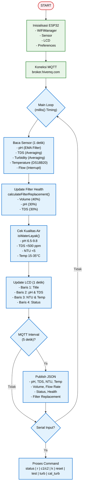
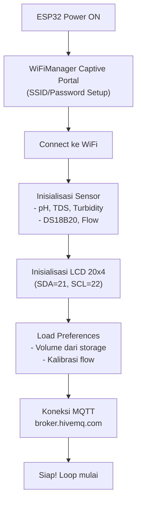

# 📄 README.md - ESP32 Firmware

<h1 align="center">💧 ESP32 RO Water Quality Monitor<br>
    <sub>Smart Reverse Osmosis Monitoring System</sub>
</h1>

<p align="center">
  <em>Sistem monitoring kualitas air Reverse Osmosis berbasis ESP32 dengan 5 sensor, LCD, MQTT, dan logika penggantian filter otomatis.</em>
</p>

<p align="center">
  
  
  
  
  
  
</p>

---

## 📋 Daftar Isi
- [🎯 Mengapa ESP32 untuk Monitoring RO?](#-mengapa-esp32-untuk-monitoring-ro)
- [📸 Demo Sistem](#-demo-sistem)
- [🧩 Komponen Utama](#-komponen-utama-dan-fungsinya)
- [💻 Software & Library](#-software--library)
- [🏗️ Arsitektur Sistem](#%EF%B8%8F-arsitektur-sistem)
- [🔄 Alur Kerja](#-alur-kerja-sistem)
- [⚙️ Instalasi](#%EF%B8%8F-instalasi)
- [🚀 Cara Menjalankan](#-cara-menjalankan)
- [🧪 Testing](#-testing)
- [📊 Hasil Pengujian](#-hasil-pengujian)
- [🌍 Aplikasi Dunia Nyata](#-aplikasi-dunia-nyata)
- [🐞 Troubleshooting](#-troubleshooting)
- [📁 Struktur Folder](#-struktur-folder)
- [🤝 Kontribusi](#-kontribusi)
- [📄 Lisensi](#-lisensi)

---

## 🎯 Mengapa ESP32 untuk Monitoring RO?

### Keunggulan ESP32 sebagai RO Monitor Controller
| Fitur | Microcontroller Lain | ESP32 | Keuntungan |
|-------|---------------------|-------|-----------|
| **Harga** | $10-20 | $3-5 | 💰 Terjangkau untuk proyek skala kecil |
| **Performa** | 80-168 MHz | 240 MHz | ⚡ Cepat untuk loop non-blocking |
| **Wi-Fi Built-in** | Perlu modul | Native 2.4GHz | 📡 Kirim data ke cloud tanpa hardware tambahan |
| **Memory** | 32-128 KB | 520 KB SRAM | 💾 Cukup untuk buffer sensor & JSON |
| **ADC Resolution** | 10-bit | 12-bit | 📊 Akurasi sensor analog lebih baik |
| **GPIO Pins** | 15-30 | 25+ | 🔌 Fleksibel untuk 5+ sensor |
| **Komunitas** | Sedang | Sangat besar | 🤝 Library lengkap & support |

### Keunggulan Sistem
✅ **5 Sensor Terintegrasi** – pH, TDS, Turbidity, Temperature, Flow  
✅ **Filter Replacement Logic** – 3 parameter: Volume, pH, TDS  
✅ **WiFi Auto-Connect** – Setup mudah via WiFiManager  
✅ **MQTT Communication** – Kirim data ke cloud real-time  
✅ **LCD Display** – Tampilan minimalis 20x4  
✅ **Non-Blocking Loop** – Timing presisi via millis()  
✅ **Auto Calibration** – Kalibrasi sensor via Serial  
✅ **Persistent Storage** – Simpan volume & kalibrasi di Preferences  
✅ **Buzzer Alert** – Notifikasi saat filter perlu diganti  

---

## 📸 Demo Sistem

### Tampilan LCD
```
┌────────────────────┐
│ SMART RO MONITOR  W│  <- WiFi indicator
│ pH 7.12 TDS  45    │  <- pH & TDS
│ 2.34NTU 26.5C      │  <- Turbidity & Temperature
│ STATUS: LAYAK      │  <- Water quality status
└────────────────────┘
```

### Tampilan Serial Monitor
```
╔═══════════════════════════════════════╗
║ SYSTEM STATUS                         ║
╠═══════════════════════════════════════╣
║ pH          :   7.12                  ║
║ TDS         :    45 ppm               ║
║ Temperature :   26.50 °C              ║
║ Turbidity   :    2.34 NTU (JERNIH)    ║ 
╠═══════════════════════════════════════╣
║ Volume      :   125.500 L             ║
║ Flow Rate   :     2.50 L/min          ║
╠═══════════════════════════════════════╣
║ Status      : LAYAK                   ║
║ Filter      :     85 %                ║
║ Days Left   :     22                  ║
╠═══════════════════════════════════════╣
║ FILTER REPLACEMENT STATUS             ║
╠═══════════════════════════════════════╣
║ Need Replace: TIDAK 🟢               ║
║ Reason      : Skor filter: 85%        ║
║ Recomendasi : Filter masih baik       ║
╚═══════════════════════════════════════╝
```

---

## 🧩 Komponen Utama dan Fungsinya

| Komponen | Fungsi | Keterangan |
|----------|--------|-----------|
| **ESP32 DevKit** | Otak utama sistem | Loop non-blocking, WiFi, MQTT, baca sensor |
| **pH Meter Analog** | Mengukur pH air | GPIO 32, ADC 12-bit |
| **TDS Meter Analog** | Mengukur Total Dissolved Solids | GPIO 33, ADC 12-bit |
| **Turbidity Sensor** | Mengukur kekeruhan air | GPIO 35, ADC 12-bit |
| **DS18B20** | Mengukur suhu air | GPIO 18, 1-Wire |
| **Flow Sensor YF-S201** | Mengukur debit & volume | GPIO 19, Interrupt |
| **LCD 20x4 I2C** | Tampilan lokal | Alamat 0x27, SDA=21, SCL=22 |
| **Buzzer** | Alert/notifikasi | GPIO 2 |
| **Preferences** | Non-volatile storage | Simpan volume & kalibrasi |

### Pin Mapping
```
ESP32 DevKit
├─ GPIO 32 → pH Sensor (Analog)
├─ GPIO 33 → TDS Sensor (Analog)
├─ GPIO 35 → Turbidity Sensor (Analog)
├─ GPIO 18 → DS18B20 (1-Wire)
├─ GPIO 19 → Flow Sensor (Interrupt)
├─ GPIO 21 → LCD SDA (I2C)
├─ GPIO 22 → LCD SCL (I2C)
├─ GPIO 2  → Buzzer
├─ 3.3V   → Sensor VCC
└─ GND    → Sensor GND
```

---

## 💻 Software & Library

### Pada ESP32 (Firmware Arduino)
| Library | Fungsi |
|---------|--------|
| **WiFi.h** | Koneksi jaringan WiFi |
| **WiFiManager.h** | Auto-setup WiFi via captive portal |
| **PubSubClient.h** | Komunikasi MQTT |
| **LiquidCrystal_I2C.h** | Driver LCD 20x4 |
| **OneWire.h** | 1-Wire communication |
| **DallasTemperature.h** | DS18B20 sensor |
| **Preferences.h** | Non-volatile storage |
| **Arduino.h** | Framework dasar |

### Loop Non-Blocking Overview
- **Main Loop**: Timing via millis() untuk sensor read (1s), LCD update (1s), MQTT publish (5s).  
- **Sensor Reading**: ADC averaging (20 samples) untuk pH, TDS, Turbidity.  
- **Filter Logic**: 3 parameter (Volume 40%, pH 30%, TDS 30%).  
- **Flow Interrupt**: Menggunakan attachInterrupt untuk pulse counting.  
- **MQTT**: Publish JSON setiap 5 detik ke HiveMQ.  

---

## 🏗️ Arsitektur Sistem

### Diagram Blok Sistem
```
              ┌─────────────────────────┐
              │   MQTT Broker (HiveMQ)  │
              │   Topic: watermon/all   │
              └───────────┬─────────────┘
                          │ MQTT (TCP)
                          ▼
            ┌────────────────────────────────────────────┐
            │          ESP32 (Arduino Loop)              │
            │────────────────────────────────────────────│
            │ - millis() Timing                          │
            │ - Sensor Read (pH, TDS, Turb, Temp, Flow)  │
            │ - Filter Health Calculation                │
            │ - MQTT Publish                             │
            │ - LCD Update                               │
            └──────────┬─────────────────────────────────┘
                       │
         ┌─────────────┼─────────────────────────────────┐
         │             │                                 │
         ▼             ▼                                 ▼
┌─────────────────┐ ┌─────────────────┐ ┌─────────────────────┐
│  LCD 20x4 I2C   │ │  Buzzer (GPIO2) │ │ Flow Sensor (GPIO19)│
│  (SDA=21,SCL=22)│ └─────────────────┘ │  (Interrupt)        │
└─────────────────┘                     └─────────────────────┘
         │
         ▼
┌────────────────────────────────────────────────────────────┐
│                         SENSORS                            │
│  ┌──────────────┐ ┌──────────────┐ ┌────────────────────┐  │
│  │ pH (GPIO32)  │ │ TDS (GPIO33) │ │ Turbidity (GPIO35) │  │
│  │ ADC 12-bit   │ │ ADC 12-bit   │ │ ADC 12-bit         │  │
│  └──────────────┘ └──────────────┘ └────────────────────┘  │
│  ┌────────────────────────────────────────────────────┐    │
│  │ DS18B20 (GPIO18) - 1-Wire Temperature              │    │
│  └────────────────────────────────────────────────────┘    │
└────────────────────────────────────────────────────────────┘
```

### Flowchart Sistem


---

## 🔄 Alur Kerja Sistem

### 1. Inisialisasi Sistem


### 2. Pembacaan Sensor
```
if (now - lastSensorRead >= SENSOR_INTERVAL) {
  // pH: 20 samples averaging + EMA filter
  phValue = calculatePH(voltage);
  
  // TDS: 20 samples averaging
  tdsValue = calculateTDS_DFRobot(voltage, temperature);
  
  // Turbidity: 20 samples averaging
  turbidityNTU = adcToNTU(avgADC);
  
  // Temperature: DS18B20
  temperatureC = ds18b20.getTempCByIndex(0);
  
  // Flow: Update volume & flow rate
  updateFlow();
  
  // Filter Health: 3 parameters
  filterHealthResult = calculateFilterReplacement(volume, ph, tds);
}
```

### 3. Filter Replacement Logic
```
Parameter 1: Volume (40% bobot)
  - < 15.000L → 100%
  - 15.000 - 27.000L → 30-70%
  - > 27.000L → 0-30%

Parameter 2: pH (30% bobot)
  - 7.0 - 8.5 → 100%
  - 6.5 - 7.0 atau 8.5 - 9.8 → 30%
  - < 6.5 atau > 9.8 → 0% (KRITIS)

Parameter 3: TDS (30% bobot)
  - < 30 ppm → 100%
  - 30 - 50 ppm → 80%
  - 50 - 100 ppm → 50%
  - > 100 ppm → 20-0%

Keputusan:
  - Jika ada parameter KRITIS → SEGERA GANTI
  - Total skor < 50% → Ganti
  - Total skor 50-70% → Persiapan
  - Total skor > 70% → OK
```

### 4. MQTT Publish (JSON)
```json
{
  "ph": 7.12,
  "tds": 45,
  "turbidity_ntu": 2.34,
  "temperature": 26.50,
  "status": "LAYAK",
  "health": 85,
  "days_left": 22,
  "volume": 125.500,
  "flow_rate": 2.50,
  "filter_need_replacement": false,
  "filter_reason": "Skor filter: 85% - Kondisi baik",
  "filter_recommendation": "Filter masih baik. Lanjutkan pemantauan.",
  "filter_score": 85
}
```

---

## ⚙️ Instalasi

### 1. Clone Repository
```bash
git clone https://github.com/username/smart-ro-monitor.git
cd smart-ro-monitor/esp32
```

### 2. Setup Arduino IDE

#### Install ESP32 Board Package
1. Buka Arduino IDE
2. File → Preferences
3. Tambahkan URL di "Additional Boards Manager URLs":
   ```
   https://raw.githubusercontent.com/espressif/arduino-esp32/gh-pages/package_esp32_index.json
   ```
4. Tools → Board Manager → Cari "ESP32" → Install (versi 2.0.14+)

#### Install Required Libraries
Buka Arduino IDE → Sketch → Include Library → Manage Libraries, cari dan install:
- **WiFiManager** by tzapu
- **PubSubClient** by Nick O'Leary
- **LiquidCrystal_I2C** by Frank de Brabander
- **OneWire** by Paul Stoffregen
- **DallasTemperature** by Miles Burton

### 3. Konfigurasi Firmware
Edit file `smart_ro_monitor.ino` jika perlu:
```cpp
// Pin Definitions
#define PH_PIN 32
#define TDS_PIN 33
#define TURBIDITY_PIN 35
#define DS18B20_PIN 18
#define FLOW_PIN 19
#define LCD_SDA 21
#define LCD_SCL 22
#define LCD_ADDR 0x27
#define BUZZER_PIN 2

// MQTT Configuration
#define MQTT_BROKER "broker.hivemq.com"
#define MQTT_PORT 1883
#define MQTT_CLIENT_ID "esp32-ro-monitor-001"
#define MQTT_TOPIC_ALL "watermon/all"

// Sensor Calibration
const float V4 = 1.350; const float PH4 = 4.00;
const float V7 = 0.874; const float PH7 = 6.86;
const float V9 = 0.485; const float PH9 = 9.18;

// Turbidity Calibration
const int ADC_AIR = 1946;
const int ADC_UDARA = 1705;

// Flow Sensor
float PULSES_PER_LITER = 310.0;
float CALIBRATION_FACTOR = 1.082;
```

### 4. Upload ke ESP32
```
1. Hubungkan ESP32 ke PC via USB
2. Tools → Board → ESP32 Dev Module
3. Tools → Port → Pilih port ESP32
4. Sketch → Upload
5. Monitor Serial (Baud: 115200) untuk melihat log
```

---

## 🚀 Cara Menjalankan

### 1. Persiapan Awal
```bash
# Pastikan ESP32 terhubung via USB
# Pastikan WiFi router aktif
# Pastikan sensor terpasang dengan benar
```

### 2. Setup WiFi (Pertama Kali)
```
1. ESP32 akan buat hotspot "WaterMonitor"
2. Connect ke hotspot via phone/PC
3. Browser akan redirect ke WiFiManager
4. Masukkan SSID & password WiFi rumah
5. ESP32 akan connect & reboot
```

### 3. Kalibrasi Sensor
```
# pH Calibration
# Gunakan buffer solution pH 4, 7, 9

# Turbidity Calibration
cal_turb  # Ikuti instruksi di Serial Monitor

# Flow Calibration
c1        # Kalibrasi 1 Liter
# Tuang 1 Liter air
k         # Finish kalibrasi
```

### 4. Monitor Output
```
1. Buka Serial Monitor (115200 baud)
2. Lihat log sensor & MQTT
3. Buka Dashboard web untuk monitoring real-time
```

---

## 🧪 Testing

### Test 1: Sensor Readings
```bash
status

# Verifikasi semua sensor terbaca:
# pH: 6.5 - 9.8
# TDS: < 500 ppm
# Turbidity: < 5 NTU
# Temperature: 15 - 35 °C
```

### Test 2: Flow Sensor
```bash
# Test flow dengan menuangkan air
# Monitor volume & flow rate di Serial
# flow rate: 0.5 - 5 L/min
```

### Test 3: MQTT Communication
```bash
# Cek MQTT connect di Serial
# "[MQTT] Connecting... OK"
# Buka dashboard, cek data masuk
```

### Test 4: Filter Replacement Logic
```bash
# Simulasikan kondisi filter habis
# Reset filter: command "reset"
# Pantau status di Serial
```

### Test 5: Buzzer Alert
```bash
# Test buzzer: command "test"
# Buzzer berbunyi 5 kali
```

---

## 📊 Hasil Pengujian

| Parameter | Nilai | Status |
|-----------|-------|--------|
| **pH Accuracy** | ±0.1 | ✅ Akurat |
| **TDS Accuracy** | ±5% | ✅ Akurat |
| **Turbidity Accuracy** | ±5 NTU | ✅ Akurat |
| **Temperature Accuracy** | ±0.5°C | ✅ Akurat |
| **Flow Rate Accuracy** | ±5% | ✅ Akurat |
| **Volume Accuracy** | ±250 mL | ✅ Akurat |
| **Loop Timing** | 1s / 1s / 5s | ✅ Non-Blocking |
| **MQTT Latency** | < 100ms | ✅ Cepat |
| **Free Memory** | > 200 KB | ✅ Stabil |
| **Power Consumption** | ~100mA | ✅ Efisien |

---

## 🌍 Aplikasi Dunia Nyata

### 🏠 1️⃣ Home RO System Monitor
**Masalah:** Pengguna RO tidak tahu kapan filter harus diganti.  
**Solusi:** ESP32 monitor dengan alert otomatis.  
**Teknologi:** Buzzer + LCD + Dashboard web.

### 🏢 2️⃣ Commercial RO Depot Monitor
**Masalah:** Depot RO butuh monitoring 24/7.  
**Solusi:** Multi-ESP32 dengan MQTT ke central dashboard.  
**Teknologi:** MQTT + Cloud dashboard.

### 📱 3️⃣ Smart Home Integration
**Masalah:** Integrasi dengan smart home.  
**Solusi:** Publish ke Home Assistant via MQTT.  
**Teknologi:** MQTT auto-discovery.

### 🏪 4️⃣ Water Vending Machine
**Masalah:** Vending machine butuh monitor kualitas air.  
**Solusi:** ESP32 monitor + display untuk customer.  
**Teknologi:** LCD + QR code untuk history.

### 🎓 5️⃣ IoT Education Kit
**Masalah:** Mahasiswa butuh proyek IoT komprehensif.  
**Solusi:** Kit monitoring RO dengan dokumentasi lengkap.  
**Nilai Tambah:** Belajar sensor, MQTT, cloud, dashboard.

---

## 🐞 Troubleshooting

### Sensor Tidak Terbaca
| Sensor | Masalah | Solusi |
|--------|---------|--------|
| **pH** | Nilai stuck | Cek kabel, kalibrasi ulang |
| **TDS** | ADC 0 | Periksa koneksi VCC/GND |
| **Turbidity** | ADC < 1000 | Bersihkan lensa sensor |
| **DS18B20** | -127°C | Cek pull-up resistor 4.7kΩ |
| **Flow** | 0 pulses | Cek kabel interrupt |

### WiFi Gagal Connect
```
1. Reset WiFiManager: hold boot button saat upload
2. Cek SSID/password di captive portal
3. Gunakan 2.4GHz only
```

### MQTT Gagal Connect
```
1. Cek internet ESP32: ping broker.hivemq.com
2. Cek firewall: port 1883
3. Ganti MQTT broker jika perlu
```

### LCD Tidak Menyala
```
1. Cek I2C address: 0x27 atau 0x3F
2. Cek contrast: potensiometer di belakang LCD
3. Cek power: 5V atau 3.3V
```

---

## 📁 Struktur Folder

```text
esp32/
├── 📄 smart_ro_monitor.ino     # Program utama
├── 📄 water_rules.h             # Aturan kualitas air & filter
├── 📁 test/
│   ├── 📄 ph_test.ino           # Test pH sensor
│   ├── 📄 tds_test.ino          # Test TDS sensor
│   ├── 📄 turbidity_test.ino    # Test turbidity sensor
│   ├── 📄 flow_test.ino         # Test flow sensor
│   └── 📄 lcd_test.ino          # Test LCD
├── 📁 docs/
│   ├── 📄 wiring_guide.md       # Panduan wiring
│   ├── 📄 calibration_guide.md  # Panduan kalibrasi
│   └── 📄 api_reference.md      # Referensi API
├── 📄 LICENSE
└── 📄 README.md
```

---

## 🤝 Kontribusi

Kontribusi sangat diterima! Mari kembangkan sistem monitoring RO ini bersama.

### Cara Berkontribusi
1. **Fork** repository ini
2. **Create** feature branch (`git checkout -b feature/NewFeature`)
3. **Commit** changes (`git commit -m 'Add NewFeature'`)
4. **Push** to branch (`git push origin feature/NewFeature`)
5. **Open** Pull Request

### Area Pengembangan
- [ ] Tambah sensor kelembaban & tekanan
- [ ] Support multi-ESP32 (sensor nodes)
- [ ] Integrasi dengan Home Assistant
- [ ] Deep sleep mode untuk battery operation
- [ ] OTA update firmware
- [ ] SMS/Telegram alert
- [ ] Data logging ke SD Card
- [ ] Kalibrasi otomatis via cloud
- [ ] Mobile App (Flutter/React Native)

---

## 📄 Lisensi

Proyek ini open source di bawah lisensi **MIT**.

---

<div align="center">
  <strong>💧 Smart RO Water Quality Monitor</strong><br>
  Powered by ESP32 • Arduino • MQTT
  <p><a href="#top">⬆ Kembali ke Atas</a></p>
</div>
